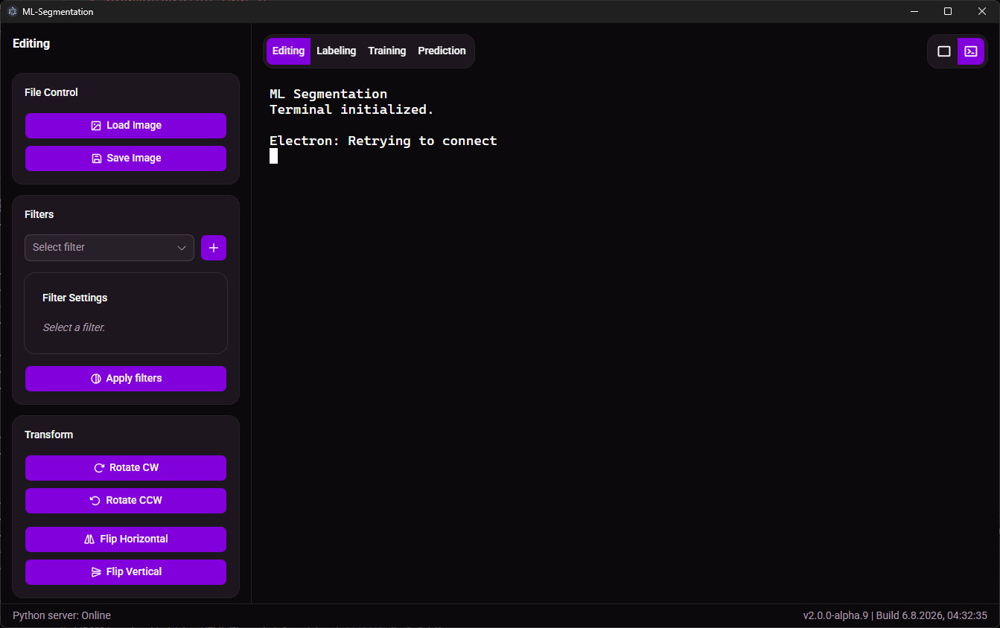

# Segmentation App 2

<div align="center">

## Editing Mode

Image preprocessing, enhancement and dataset preparation.

</div>


<br>

<div align="center">

## Labeling Mode

Semantic annotation with configurable labels, brush tools and layer management.

</div>


<br>

<div align="center">

## Terminal Output

Live console output from the Electron app and Python server.

</div>



## Table of Contents

- [Segmentation App 2](#segmentation-app-2)
  - [Editing Mode](#editing-mode)
  - [Labeling Mode](#labeling-mode)
  - [Terminal Output](#terminal-output)
  - [Table of Contents](#table-of-contents)
  - [About](#about)
  - [Architecture](#architecture)
  - [Installation](#installation)
    - [How to Install the Release](#how-to-install-the-release)
  - [Project Structure](#project-structure)
  - [How to Build and Run the Project](#how-to-build-and-run-the-project)
    - [Recommended VS Code extensions](#recommended-vs-code-extensions)
    - [Install VS Code extensions](#install-vs-code-extensions)
    - [Download the repository](#download-the-repository)
    - [Install Node.js and Python](#install-nodejs-and-python)
    - [Install Node.js packages](#install-nodejs-packages)
    - [Install Python packages](#install-python-packages)
    - [npm Commands Overview](#npm-commands-overview)
      - [Root Project Commands (`package.json`)](#root-project-commands-packagejson)
      - [Frontend Project Commands (`svelte-frontend/package.json`)](#frontend-project-commands-svelte-frontendpackagejson)
    - [Build the Electron app (GitHub Actions)](#build-the-electron-app-github-actions)
      - [GitHub Actions workflow files](#github-actions-workflow-files)
      - [`build-all.yml`](#build-allyml)
      - [`build-linux.yml`](#build-linuxyml)
      - [`build-macos.yml`](#build-macosyml)
      - [`build-windows.yml`](#build-windowsyml)
      - [Common workflow steps](#common-workflow-steps)
      - [Build configuration](#build-configuration)
    - [Build the Electron app (Local)](#build-the-electron-app-local)
    - [Test the Electron App](#test-the-electron-app)
    - [Test the Svelte Frontend](#test-the-svelte-frontend)
    - [Build the Svelte Frontend](#build-the-svelte-frontend)
    - [Run Unit Tests](#run-unit-tests)
    - [Integration Tests](#integration-tests)
    - [Run End-to-End (E2E) Tests](#run-end-to-end-e2e-tests)
  - [How to Debug the App in VS Code](#how-to-debug-the-app-in-vs-code)
  - [Manual](#manual)
  - [License](#license)

## About

ML-Segmentation 2 is an open-source desktop application for machine learning-based image segmentation. It combines dataset management, image labeling, image editing, model training, and inference into a single cross-platform workflow powered by Python, fastai, Electron, and Svelte.

The project is currently in the **alpha** stage of development. While the core architecture is in place, many features are still under active development and may change significantly before the first stable release. Expect incomplete functionality, bugs, breaking changes, and limited documentation as the application continues to evolve.

The project also serves as a practical software engineering playground, focusing on code quality, testing, maintainability, performance, and modern desktop application development practices.

## Architecture

**Backend:**  
[Python](https://www.python.org/) implements the core application logic and data processing. It runs a local server responsible for receiving and transmitting commands, image data, and application state. The backend integrates the [fastai](https://www.fast.ai/) framework to train neural networks for image segmentation and perform predictions using trained models. It also manages dataset preparation, model loading, training workflows, and inference pipelines.

**Bridge:**  
[Electron](https://www.electronjs.org/) packages the frontend as a cross-platform desktop application and provides the connection layer between the user interface and the Python backend using [TypeScript](https://www.typescriptlang.org/) and [Node.js](https://nodejs.org/).

**IPC (Inter-Process Communication) and Client–Server:**  
The application uses a local client–server architecture to enable communication between the frontend client and the Python backend server. [WebSocket](https://developer.mozilla.org/en-US/docs/Web/API/WebSockets_API) technology provides real-time, bidirectional communication for exchanging commands, image data, segmentation results, and application events.

**Frontend:**  
[Svelte](https://svelte.dev/) is used for dynamic UI rendering and interactive user experiences. The interface is built with [shadcn-svelte](https://www.shadcn-svelte.com/) components, styled using [Tailwind CSS](https://tailwindcss.com/), and uses [Konva](https://konvajs.org/) for interactive canvas-based image editing, drawing, labeling, and segmentation mask manipulation.

**Cross-Platform Distribution:**  
The complete pipeline is open source and distributed as native desktop applications for multiple platforms, including **Windows**, **Linux** (Debian and Ubuntu), and **macOS**. This provides a consistent installation and user experience across supported operating systems.

## Installation

Pre-built binaries for Windows, Linux (Debian), and macOS will be provided via [GitHub Actions](https://docs.github.com/en/actions). Please see the OS-specific sections below for instructions on how to install the corresponding release on your system.  

In future releases the python packages will be installed directly from the app.

### How to Install the Release

- Download and install [Python](https://www.python.org/downloads/). During installation please **disable** the `MAX_PATH` limit.  
- Download the latest release from GitHub and place it in your Desktop folder. Make sure to download both the compiled application binary (named according to the format ${productName}-${version}-${arch}) and the compressed source archive. The binary is required to install and run the application, while the source files are needed for the Python package installation steps.  
- The installation procedure depends on your operating system. Follow the platform-specific instructions: run the installer on Windows, move the application to the appropriate application directory on macOS, or follow the recommended installation steps for your Linux distribution.
- Unzip the source files into your `Desktop` folder.  
- Follow the instructions in [Install Python packages](#install-python-packages)
- After `pip` installed all packages, run the setup executable. The executable can also be run before installing all Python packages, but the app won't work.  

## Project Structure

The root project folder `ml-segmentation-2` is divided into three main directories:

- **`\python` directory**  
  contains the backend implementation written in [Python](https://www.python.org/about/).

  This backend runs a server that processes requests sent from the frontend and performs computational tasks such as machine learning, image generation, graphics processing, and data analysis.

  The backend server communicates with the frontend using WebSocket connections, allowing real-time bidirectional communication between the user interface and the processing engine.

  The Python server integrates the [fastai](https://www.fast.ai/) API to provide deep learning functionality for image segmentation tasks. It uses pretrained or custom-trained models to perform pixel-level image segmentation predictions, identifying and classifying specific regions within input images.

  In addition to inference, the backend supports model training workflows through the fastai training API. It manages dataset preparation, model configuration, training execution, validation, and model updates, enabling users to train and improve segmentation models based on new image data.

- **`\src` directory**  
  contains [TypeScript](https://www.typescriptlang.org/) application logic responsible for starting and coordinating all major components of the desktop application. It acts as the central runtime layer connecting the backend server, the frontend UI, and the desktop container.

  The code implements the [Electron](https://www.electronjs.org/) API for creating cross-platform desktop applications. Electron provides the runtime environment that combines web technologies with native operating system capabilities, allowing the application to run on multiple platforms such as Windows, macOS, and Linux using a shared codebase.

  The Electron layer acts as an interface between the [Svelte](https://svelte.dev/) frontend and operating system-specific functionality. It exposes controlled APIs that allow the frontend user interface to communicate with native system commands, access desktop features, and execute platform-dependent operations while maintaining separation between the UI and the underlying operating system.

- **`\svelte-frontend` directory**  
  contains the graphical user interface of the application. The frontend is implemented using [Svelte](https://svelte.dev/) with application logic written in TypeScript.

  The interface uses [shadcn-svelte](https://www.shadcn-svelte.com/) components, which provide reusable and customizable UI elements designed specifically for Svelte applications. These components are styled and adapted using [Tailwind CSS](https://tailwindcss.com/), a utility-first CSS framework that provides predefined styling classes for controlling layout, spacing, colors, typography, and responsive behavior directly within the application markup. This approach enables consistent design patterns while allowing fine-grained customization of the user interface.

  For interactive image processing functionality, the frontend integrates [Konva](https://konvajs.org/), a 2D canvas framework that enables high-performance rendering and manipulation of graphical objects in the browser. Konva is used to implement image editing features such as labeling, drawing, object manipulation, image cropping, and interactive visualization of image data. It provides the foundation for creating a dynamic workspace where users can modify and analyze images directly within the application.

Other directories and files included in the root folder:

- `.github/workflows` contains GitHub Actions workflow YAML files that define automated processes for continuous integration, including building, testing, and releasing the application on different operating systems.
- `.pytest_cache` contains cache files generated by pytest to speed up subsequent test executions. The contents are automatically created and do not need to be version controlled.
- `assets` contains static application resources such as images, icons, and other files required by the application.
- `dist` contains generated build files produced during the compilation process of the Electron application, including compiled JavaScript output from the TypeScript `src` directory.
- `e2e` contains end-to-end tests written with Playwright that verify the behaviour of the complete desktop application by launching Electron and interacting with the user interface.
- `make` contains configuration and generated files used by Electron Builder during the application packaging process.
- `node_modules` contains Node.js packages and dependencies required to develop, build, and run the Electron application.
- `playwright-report` contains HTML reports generated by Playwright after executing end-to-end tests. These reports provide detailed information about test results, screenshots, traces, and execution logs.
- `python` contains the Python backend implementation, including the server logic, machine learning functionality, and required Python dependencies.
- `src` contains the main Electron application source code written in TypeScript, responsible for managing the desktop application lifecycle, communication between components, and integration with the operating system.
- `svelte-frontend` contains the Svelte-based graphical user interface of the application.
- `test-results` contains artifacts generated during Playwright test execution, such as screenshots, traces, videos, and logs for failed or completed tests.
- `.gitignore` defines files and directories that are excluded from version control using Git.
- `.prettierrc` contains the configuration for Prettier, which automatically formats source code according to predefined style rules.
- `eslint.config.ts` contains the configuration for ESLint, which analyzes TypeScript and JavaScript code to detect errors and enforce coding standards.
- `package.json` defines the Node.js project configuration, including dependencies, scripts, and metadata required for building and running the application.
- `package-lock.json` records the exact versions of installed Node.js dependencies to ensure reproducible installations.
- `playwright.config.ts` contains the configuration for Playwright, including browser and Electron settings, test locations, reporters, timeouts, fixtures, and other options used when executing end-to-end tests.
- `pytest.ini` contains the configuration for pytest, including test discovery rules, default command-line options, markers, and other settings used when executing Python tests.
- `tsconfig.json` contains the configuration for the TypeScript compiler.
- `vitest.config.ts` contains the configuration for Vitest, which is used for running automated unit and integration tests.

Other directories and files included in the `svelte-frontend` directory:

- `\svelte-frontend\.vscode` contains Visual Studio Code workspace settings and configuration files used to customize the development environment for the frontend project.
- `\svelte-frontend\dist` contains the production build output generated by Vite, including optimized JavaScript, CSS, and static assets used when deploying the frontend application.
- `\svelte-frontend\node_modules` contains Node.js packages and dependencies required to develop, build, and run the Svelte frontend application.
- `\svelte-frontend\public` contains static assets that are directly copied into the final frontend build without additional processing by Vite.
- `\svelte-frontend\src` contains the main Svelte frontend source code, including components, application logic, styles, and other resources required to build the user interface.
- `\svelte-frontend\stats.html` contains the generated bundle visualization report from Vite/Rollup, used to analyze JavaScript chunk sizes and dependency contributions.
- `\svelte-frontend\.gitignore` defines files and directories that are excluded from version control using Git.
- `\svelte-frontend\components.json` contains the configuration for [shadcn-svelte](https://www.shadcn-svelte.com/) components, defining component paths and styling-related settings.
- `\svelte-frontend\index.html` contains the main HTML entry point used by Vite to initialize and load the Svelte application.
- `\svelte-frontend\package.json` defines the frontend project configuration, including dependencies, scripts, and metadata required for development and building.
- `\svelte-frontend\package-lock.json` records the exact versions of installed Node.js dependencies to ensure reproducible installations.
- `\svelte-frontend\svelte.config.js` contains the configuration for the [Svelte](https://svelte.dev/docs/kit/configuration) framework.
- `\svelte-frontend\tsconfig.json` contains the base configuration for the [TypeScript compiler](https://www.typescriptlang.org/docs/handbook/tsconfig-json.html).
- `\svelte-frontend\tsconfig.app.json` contains TypeScript compiler settings specific to the Svelte application source code.
- `\svelte-frontend\tsconfig.node.json` contains TypeScript compiler settings for Node.js-based configuration files such as Vite configuration.
- `\svelte-frontend\vite.config.ts` contains the configuration for [Vite](https://vite.dev/config/), which manages the frontend development server, module bundling, and production builds.

> Note: Directories such as `\svelte-frontend\dist` and `\svelte-frontend\node_modules` are generated automatically after running corresponding `npm` commands and build processes.*

## How to Build and Run the Project

### Recommended VS Code extensions

The following VS Code extensions are recommended to provide a consistent development environment for contributors.

| Extension | Purpose |
| --- | --- |
| `aaron-bond.better-comments` | Improves code comments by adding visual categories such as notes, warnings, and TODOs. |
| `bierner.markdown-preview-github-styles` | Provides a GitHub-like preview for Markdown documentation. |
| `bmalehorn.shell-syntax` | Adds syntax highlighting for shell scripts and commands. |
| `bradlc.vscode-tailwindcss` | Provides Tailwind CSS IntelliSense and class suggestions. |
| `christian-kohler.npm-intellisense` | Provides autocomplete for npm modules in JavaScript and TypeScript files. |
| `christian-kohler.path-intellisense` | Provides autocomplete for file paths. |
| `davidanson.vscode-markdownlint` | Checks Markdown files for formatting and documentation quality issues. |
| `dbaeumer.vscode-eslint` | Detects JavaScript and TypeScript code quality issues. |
| `donjayamanne.githistory` | Displays Git file history and commit information. |
| `donjayamanne.python-environment-manager` | Helps manage Python environments inside VS Code. |
| `esbenp.prettier-vscode` | Automatically formats code using Prettier. |
| `formulahendry.auto-close-tag` | Automatically adds closing HTML/XML tags. |
| `formulahendry.auto-rename-tag` | Renames matching HTML/XML tags automatically. |
| `formulahendry.code-runner` | Allows quick execution of code snippets and scripts. |
| `gruntfuggly.todo-tree` | Collects and displays TODO comments across the project. |
| `htmlhint.vscode-htmlhint` | Checks HTML files for common issues and best practices. |
| `humao.rest-client` | Allows testing HTTP requests directly from VS Code. |
| `jasonnutter.search-node-modules` | Helps locate and search installed npm dependencies. |
| `ms-playwright.playwright` | Provides tools for browser automation and end-to-end testing. |
| `ms-python.autopep8` | Automatically formats Python code according to PEP 8. |
| `ms-python.debugpy` | Provides Python debugging support. |
| `ms-python.pylint` | Performs Python code quality checks. |
| `ms-python.python` | Adds Python language support. |
| `ms-python.vscode-pylance` | Provides Python IntelliSense, type checking, and analysis. |
| `ms-python.vscode-python-envs` | Provides Python environment management features. |
| `ms-toolsai.jupyter` | Adds support for Jupyter notebooks. |
| `ms-toolsai.jupyter-keymap` | Adds familiar Jupyter keyboard shortcuts. |
| `ms-toolsai.jupyter-renderers` | Improves rendering of Jupyter outputs. |
| `ms-toolsai.vscode-jupyter-cell-tags` | Supports Jupyter cell metadata and tagging. |
| `ms-toolsai.vscode-jupyter-slideshow` | Allows creating presentations from Jupyter notebooks. |
| `ms-vscode-remote.remote-containers` | Enables development inside Docker containers. |
| `ms-vscode-remote.remote-ssh` | Allows development on remote machines through SSH. |
| `ms-vscode-remote.remote-wsl` | Enables development using Windows Subsystem for Linux. |
| `ms-vscode-remote.vscode-remote-extensionpack` | Installs common extensions for remote development. |
| `openai.chatgpt` | Provides AI-assisted coding, debugging, and documentation support. |
| `redhat.vscode-yaml` | Provides YAML validation and editing support. |
| `ritwickdey.liveserver` | Starts a local development server with live browser updates. |
| `rvest.vs-code-prettier-eslint` | Integrates Prettier formatting with ESLint rules. |
| `selemondev.vscode-shadcn-svelte` | Provides support for shadcn-svelte components. |
| `svelte.svelte-vscode` | Adds Svelte language support and IntelliSense. |
| `vitest.explorer` | Provides a graphical interface for running Vitest tests. |
| `xabikos.javascriptsnippets` | Provides useful JavaScript code snippets. |
| `yzhang.markdown-all-in-one` | Adds Markdown shortcuts, formatting, and navigation features. |
| `zainchen.json` | Improves JSON editing and formatting. |

These extensions can be installed automatically using the recommended extensions file located at `.vscode/extensions.json`.

### Install VS Code extensions

Open the project in VS Code and install the recommended extensions when prompted.

Alternatively, open the Extensions panel (`Ctrl + Shift + X`) and select **Install Workspace Recommended Extensions**.

### Download the repository

Download the repository as a ZIP file, extract it, and navigate to the root folder `ml-segmentation-app-2`.

Alternatively, clone the repository from GitHub using Git:

```bash
git clone https://github.com/kerimyalcin95/ml-segmentation-app-2.git
```

Navigate into the project directory:

```bash
cd ml-segmentation-app-2
```

### Install Node.js and Python

Install [Node.js](https://nodejs.org/en/download) and [Python](https://www.python.org/downloads/).

**Windows (console):**

```bash
winget install OpenJS.NodeJS.LTS
winget install Python.Python.3
```

**Linux (Ubuntu/Debian):**

```bash
sudo apt update
sudo apt install nodejs npm python3 python3-pip
```

Verify installation:

```bash
node --version
npm --version
python --version
```

### Install Node.js packages

Install the project dependencies by running the following command inside the root folder `ml-segmentation-2`:

```bash
npm install
```

Then navigate to the `/svelte-frontend` folder and install its dependencies:

```bash
cd svelte-frontend
npm install
```

### Install Python packages

Install the required Python dependencies using `pip`.

**Windows (console):**

Update `pip` before installing packages:

```bash
python -m pip install --upgrade pip
```

Install the required packages:

```bash
pip install websockets opencv-python fastai
```

Alternatively, install packages individually:

```bash
pip install websockets
pip install opencv-python
pip install fastai
```

> Note: The current development version of the project only requires the `websockets` package.

To remove all installed packages from the current Python environment:

```bash
pip freeze > packages.txt
pip uninstall -r packages.txt -y
```

**Linux (Ubuntu/Debian):**

Install Python and `pip` if not already installed:

```bash
sudo apt update
sudo apt install python3 python3-pip
```

Update `pip`:

```bash
python3 -m pip install --upgrade pip
```

Install the required packages:

```bash
pip3 install websockets opencv-python fastai
```

**macOS:**

Install Python using [Homebrew](https://brew.sh/) if not already installed:

```bash
brew install python
```

Update `pip`:

```bash
python3 -m pip install --upgrade pip
```

Install the required packages:

```bash
pip3 install websockets opencv-python fastai
```

To remove all installed packages from the current Python environment:

```bash
pip3 freeze > packages.txt
pip3 uninstall -r packages.txt -y
```

### npm Commands Overview

The project uses npm scripts defined in two `package.json` files:

- The root `package.json` contains Electron, backend, testing, debugging, and release commands.
- The `svelte-frontend/package.json` contains Svelte frontend development and build commands.

#### Root Project Commands (`package.json`)

| Command | Description |
| --- | --- |
| `npm install` | Installs all project dependencies. |
| `npm run verify` | Runs the complete test suite, compiles the Electron application, and builds the Svelte frontend in debug mode to verify the project. |
| `npm run build:debug` | Compiles the Electron TypeScript source code and builds the Svelte frontend in debug mode (unminified with source maps). |
| `npm run build:release` | Compiles the Electron TypeScript source code and builds the Svelte frontend for release. |
| `npm start` | Builds the application in debug mode and launches the Electron desktop application. |
| `npm run debug` | Builds the application in debug mode and launches Electron with the Node.js and Chromium remote debuggers enabled. |
| `npm run make` | Cleans previous build artifacts, builds the release version, and creates platform-specific distributable packages using Electron Builder. |
| `npm test` | Runs the complete test suite, including Electron, Svelte, and Python tests. |
| `npm run test:electron` | Runs the Electron unit tests using Vitest. |
| `npm run test:svelte` | Runs the Svelte frontend unit tests using Vitest. |
| `npm run test:python` | Runs the Python backend tests using pytest. |
| `npm run test:e2e` | Builds the application in debug mode and runs the Playwright end-to-end test suite. |
| `npm run test:e2e:ui` | Opens the Playwright interactive test runner. |
| `npm run test:e2e:headed` | Runs the Playwright end-to-end tests with a visible browser window. |
| `npm run test:e2e:debug` | Runs the Playwright end-to-end tests in debug mode. |
| `npm run test:e2e:report` | Opens the most recent Playwright HTML test report. |
| `npm run clean:dist` | Removes the generated Electron build output from the `dist` directory. |
| `npm run clean:make` | Removes generated installer and package artifacts from the `make` directory. |
| `npm run package` | Packages the application without creating an installer. |
| `npm run make:package` | Builds the release version and packages the application without creating an installer. |
| `npm run make:standalone` | Alias for `npm run make:package`. |
| `npm run make:setup` | Builds the release version and creates a platform-specific installer. |
| `npm run make-installer` | Alias for `npm run make:setup`. |
| `npm run fe:build:debug` | Builds the Svelte frontend in debug mode. |
| `npm run fe:build:release` | Builds the Svelte frontend for release. |
| `npm run fe:preview` | Starts the Svelte production preview server. |
| `npm run fe:start` | Alias for `npm run fe:preview`. |
| `npm run fe:dev` | Starts the Svelte development server. |
| `npm run fe:check` | Checks Svelte components and TypeScript files for errors. |
| `npm run fe:test` | Runs the Svelte frontend tests using Vitest. |
| `npm run fe:npm` | Executes npm commands in the `svelte-frontend` directory. |

#### Frontend Project Commands (`svelte-frontend/package.json`)

| Command | Description |
| --- | --- |
| `npm install` | Installs the frontend dependencies. |
| `npm run dev` | Starts the Vite development server. |
| `npm run build` | Builds the Svelte frontend using Vite's default production mode. |
| `npm run build:debug` | Builds the Svelte frontend in debug mode (typically unminified with source maps). |
| `npm run build:release` | Builds the optimized production version of the Svelte frontend. |
| `npm run verify` | Runs the frontend unit tests and builds the frontend in debug mode. |
| `npm run preview` | Starts a local preview server for the production build. |
| `npm test` | Runs the frontend unit tests using Vitest. |
| `npm run check` | Checks Svelte components and TypeScript configuration for errors. |

### Build the Electron app (GitHub Actions)

The project can be built automatically using GitHub Actions. The workflows create platform-specific application packages on GitHub's build servers.

To start a build manually:

1. Open the repository on GitHub.
2. Go to **Actions**.
3. Select the desired workflow.
4. Click **Run workflow**.
5. Download the generated artifact after the build finishes.

The build output is stored as a workflow artifact and can be downloaded from the completed workflow run.

#### GitHub Actions workflow files

All workflow files are located in:

```text
.github/workflows/
```

#### `build-all.yml`

Builds the application for all supported platforms:

- Windows → `.exe` installer
- Linux → `.deb` package
- macOS → `.dmg` package

The workflow uses a build matrix to run the same build process on multiple operating systems simultaneously.

Main steps:

- Checks out the repository.
- Installs Node.js.
- Installs root and frontend dependencies.
- Runs `npm run make`.
- Uploads the generated installer as an artifact.

#### `build-linux.yml`

Builds only the Linux version.

Output:

```text
make/*.deb
```

Used for creating Debian packages for Ubuntu/Debian-based distributions.

#### `build-macos.yml`

Builds only the macOS version.

Output:

```text
make/*.dmg
```

Creates a macOS disk image containing the application.

#### `build-windows.yml`

Builds only the Windows version.

Output:

```text
make/*.exe
```

Creates the Windows installer using Electron Builder.

#### Common workflow steps

All workflows perform the same basic build process:

| Step | Description |
| --- | --- |
| `actions/checkout` | Downloads the repository source code to the build machine. |
| `actions/setup-node` | Installs the required Node.js version and enables npm caching. |
| `npm ci` | Installs dependencies from `package-lock.json`. |
| `npm run make` | Builds the application and creates the platform package. |
| `actions/upload-artifact` | Stores the generated installer as a downloadable build artifact. |

#### Build configuration

The generated packages are configured through the `build` section in the root `package.json`.

Electron Builder uses this configuration to determine:

- Application name and version.
- Included files.
- Application icons.
- Target package format.
- Output filenames.
- Installer options.

### Build the Electron app (Local)

Inside the project folder, run:

```bash
npm run make
```

This command builds the complete Electron application:

- The backend TypeScript files are compiled into JavaScript and saved to `dist`.
- The Svelte frontend is built and saved to `svelte-frontend/dist`.
- Electron Builder packages the application into a distributable release to `make`

### Test the Electron App

Inside the project folder, run:

```bash
npm run start
```

This command builds the backend and Svelte frontend, then starts the Electron application for local testing.

### Test the Svelte Frontend

Start the Svelte frontend development server using:

```bash
npm run fe-dev
```

This starts the Vite development server and opens the Svelte frontend in a browser. Changes to the frontend files are automatically updated during development.

Alternatively, run the command directly inside the `svelte-frontend` folder:

```bash
cd svelte-frontend
npm run dev
```

To stop the development server, press:

```bash
q + Enter
```

### Build the Svelte Frontend

Build the Svelte frontend using:

```bash
npm run fe-build
```

This compiles the Svelte frontend into production files and saves the output to `svelte-frontend/dist`.

Alternatively, run the build command directly inside the `svelte-frontend` folder:

```bash
cd svelte-frontend
npm run build
```

### Run Unit Tests

The project uses [unit tests](https://learn.microsoft.com/en-us/visualstudio/test/getting-started-with-unit-testing?view=vs-2022) to verify that individual components work correctly in isolation. These tests focus on small, self-contained pieces of functionality such as classes, functions, and Svelte components without requiring the entire application to run.

The project contains three unit test suites:

- Electron (TypeScript) using [Vitest](https://vitest.dev/)
- Svelte frontend using [Vitest](https://vitest.dev/)
- Python backend using [pytest](https://docs.pytest.org/)

TypeScript test files follow the naming convention `*.test.ts` and are located next to the files they test. Python test files follow the pytest naming conventions and are automatically discovered by `pytest`.

Run all unit tests from the project root:

```bash
npm test
```

Or run each suite individually:

```bash
npm run test:electron
npm run test:svelte
npm run test:python
```

---

### Integration Tests

[Integration tests](https://learn.microsoft.com/en-us/dotnet/core/testing/unit-testing-best-practices#unit-tests-vs-integration-tests) verify that multiple components work correctly together. Unlike unit tests, they test the interaction between modules rather than testing each module in isolation.

Typical examples in this project include:

- Communication between Electron and the Python backend.
- Communication between the Electron main process and the Svelte renderer.
- Reading and writing files through the application's services.
- Communication over WebSockets.

Integration tests should be implemented whenever new functionality depends on two or more components interacting correctly. They help detect interface mismatches, communication errors, and regressions that unit tests cannot identify.

Integration tests are included in the corresponding Electron, Svelte, or Python test suites and are executed together with the unit tests when running:

```bash
npm test
```

---

### Run End-to-End (E2E) Tests

[End-to-end (E2E) tests](https://playwright.dev/docs/intro) verify that the complete application behaves correctly from the user's perspective. Instead of testing individual components in isolation, they launch the full Electron application and simulate real user interactions, ensuring that the frontend, Electron process, and Python backend work together as expected.

The project uses [Playwright](https://playwright.dev/) for end-to-end testing.

E2E test files are located in the `e2e` directory.

Run the complete end-to-end test suite:

```bash
npm run test:e2e
```

Useful Playwright commands:

```bash
npm run test:e2e:ui
```

Opens Playwright's interactive test runner.

```bash
npm run test:e2e:headed
```

Runs the tests with a visible application window.

```bash
npm run test:e2e:debug
```

Runs the tests in debug mode.

```bash
npm run test:e2e:report
```

Opens the HTML report generated after the most recent test run.

During execution, Playwright generates temporary test artifacts in the `test-results` directory. HTML reports are written to the `playwright-report` directory.

## How to Debug the App in VS Code

The project includes Visual Studio Code launch configurations for debugging the Electron application.

Start the application in debug mode:

```bash
npm run debug
```

Open **Run and Debug** (`Ctrl + Shift + D`) and select one of the following configurations:

- **Attach Electron** – Attaches to both the Electron main process and renderer process (recommended).
- **Attach Electron Main** – Attaches only to the Electron main process (Node.js).
- **Attach Electron Renderer** – Attaches only to the Electron renderer process (Chromium/Svelte).

After attaching, breakpoints can be placed directly in the TypeScript source code, allowing inspection of variables, the call stack, and application state.

## Manual

TODO

## License

This project is licensed under the [MIT License](LICENSE).

Some components of this project use third-party software. The corresponding licenses and notices can be found in [THIRD_PARTY_LICENSE](THIRD_PARTY_LICENSE).
