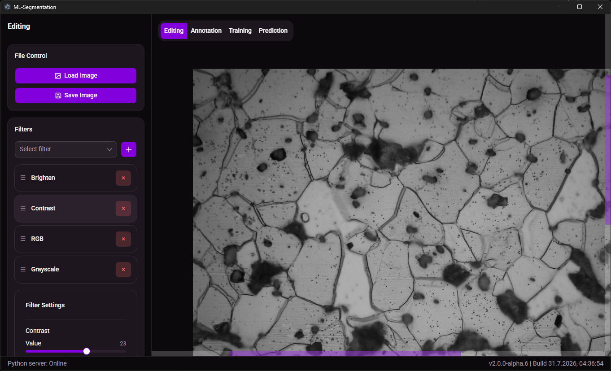
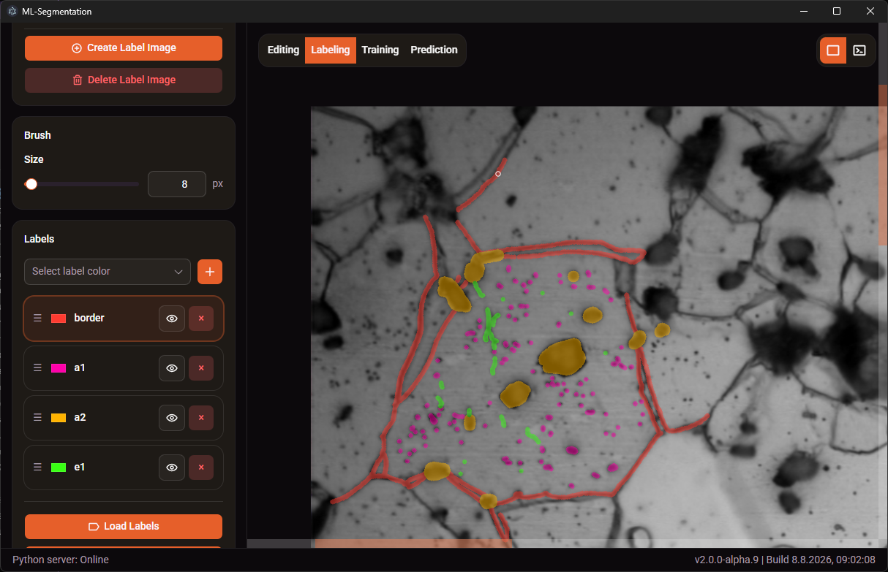
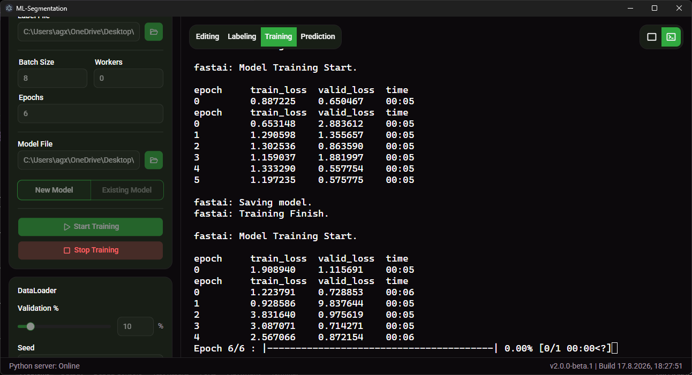
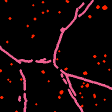
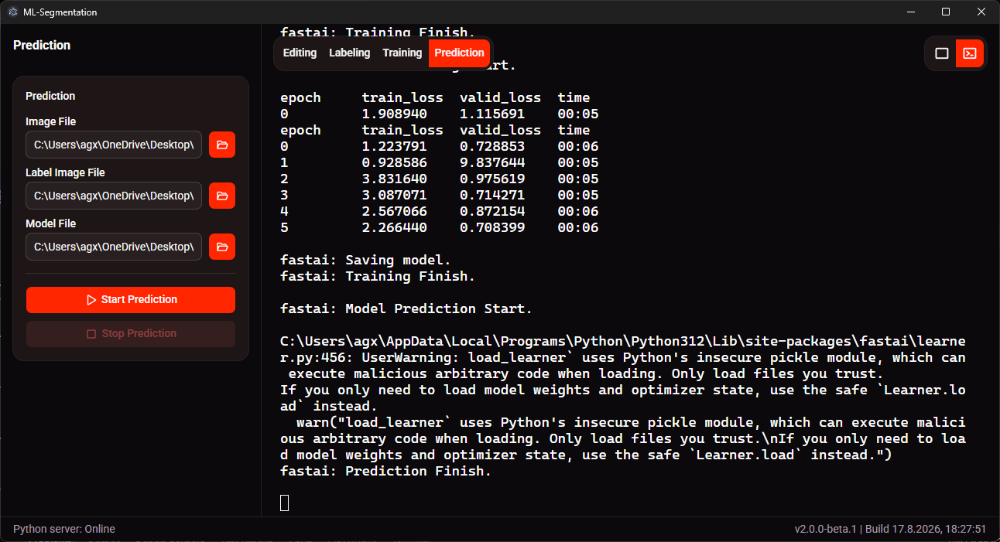
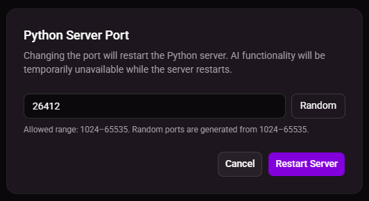
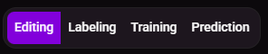
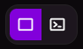

<div align="center">

# Segmentation App 2.0.0

</div>

<div align="center">

## Editing Mode

Image preprocessing, enhancement and dataset preparation.

</div>



<div align="center">

| image/32.png |
|:---:|
|  |

</div>

<div align="center">

## Labeling Mode

Semantic annotation with configurable labels, brush tools and layer management.

</div>



<div align="center">

<div align="center">

| label/32.png |
|:---:|
|  |

</div>

## Training Mode

Train segmentation models with labeled images, reference images and live terminal output.

</div>



<div align="center">

|...| 29.png | 30.png | 31.png | ... |
|:---:|:---:|:---:|:---:|:---:|
| ... |  |  |  | ... |
| ... |  |  |  | ... |

</div>

<div align="center">

## Prediction Mode

Run trained segmentation models on images and generate label images.

</div>



<div align="center">

<table>
  <tr>
    <th><div align="center">predict-image/896x896.png</div></th>
    <th><div align="center">predict-label/896x896.png</div></th>
  </tr>
  <tr>
    <td align="center">
      
    </td>
    <td align="center">
      
    </td>
  </tr>
</table>

</div>

## Table of Contents

- [Segmentation App 2.0.0](#segmentation-app-200)
  - [Editing Mode](#editing-mode)
  - [Labeling Mode](#labeling-mode)
  - [Training Mode](#training-mode)
  - [Prediction Mode](#prediction-mode)
  - [Table of Contents](#table-of-contents)
  - [About](#about)
  - [Architecture](#architecture)
  - [Installation](#installation)
    - [How to Install the App](#how-to-install-the-app)
    - [Platform Stability](#platform-stability)
  - [Project Structure](#project-structure)
  - [How to Build and Run the Project](#how-to-build-and-run-the-project)
    - [Recommended VS Code Extensions](#recommended-vs-code-extensions)
    - [Install VS Code Extensions](#install-vs-code-extensions)
    - [Download the Repository](#download-the-repository)
    - [Install Node.js](#install-nodejs)
      - [Windows](#windows)
      - [Linux (Ubuntu)](#linux-ubuntu)
      - [macOS](#macos)
      - [Verify Node.js](#verify-nodejs)
    - [Install Python 3.12](#install-python-312)
      - [Windows](#windows-1)
      - [Linux (Ubuntu)](#linux-ubuntu-1)
      - [macOS](#macos-1)
      - [Verify Python](#verify-python)
    - [Install Node.js Packages](#install-nodejs-packages)
    - [Install Python 3.12 Packages](#install-python-312-packages)
      - [Windows](#windows-2)
      - [Linux (Ubuntu)](#linux-ubuntu-2)
      - [macOS](#macos-2)
    - [npm Commands Overview](#npm-commands-overview)
      - [Root Project Commands (`package.json`)](#root-project-commands-packagejson)
      - [Frontend Project Commands (`svelte-frontend/package.json`)](#frontend-project-commands-svelte-frontendpackagejson)
    - [Build the Electron App (GitHub Actions)](#build-the-electron-app-github-actions)
      - [GitHub Actions Workflow Files](#github-actions-workflow-files)
      - [`build-all.yml`](#build-allyml)
      - [`build-linux.yml`](#build-linuxyml)
      - [`build-macos.yml`](#build-macosyml)
      - [`build-windows.yml`](#build-windowsyml)
      - [Common Workflow Steps](#common-workflow-steps)
      - [Build Configuration](#build-configuration)
    - [Build the Electron App (Local)](#build-the-electron-app-local)
    - [Test the Electron App](#test-the-electron-app)
    - [Test the Svelte Frontend](#test-the-svelte-frontend)
    - [Build the Svelte Frontend](#build-the-svelte-frontend)
    - [Run Unit Tests](#run-unit-tests)
    - [Integration Tests](#integration-tests)
    - [Run End-to-End (E2E) Tests](#run-end-to-end-e2e-tests)
  - [How to Debug the App in VS Code](#how-to-debug-the-app-in-vs-code)
  - [Manual](#manual)
    - [Getting Started](#getting-started)
      - [Install Python and Python Packages](#install-python-and-python-packages)
      - [Set Up the Python Server](#set-up-the-python-server)
      - [Basic Workflow](#basic-workflow)
      - [Switch Between Application Modes](#switch-between-application-modes)
      - [Switch Between View Modes](#switch-between-view-modes)
      - [Automatic Configuration Saving](#automatic-configuration-saving)
    - [Editing Mode](#editing-mode-1)
    - [Labeling Mode](#labeling-mode-1)
    - [Training Mode](#training-mode-1)
    - [Prediction Mode](#prediction-mode-1)
    - [Troubleshooting](#troubleshooting)
      - [PIL `_imaging` Import Error on Ubuntu](#pil-_imaging-import-error-on-ubuntu)
      - [CUDA Compatibility Error](#cuda-compatibility-error)
      - [Disk Quota Exceeded During PyTorch Installation](#disk-quota-exceeded-during-pytorch-installation)
  - [License](#license)

## About

ML-Segmentation 2 is an open-source desktop application for machine learning-based image segmentation. It combines dataset management, image labeling, image editing, model training, and inference into a single cross-platform workflow powered by Python, fastai, Electron, and Svelte.

The project has been **fully tested and released**. The core functionality, application workflow, and supported platform builds have been tested to ensure that the application is ready for use. The project continues to be maintained and improved, with future releases potentially introducing new features, improvements, and changes.

The project also serves as a practical software engineering project, focusing on code quality, testing, maintainability, performance, and modern desktop application development practices.

## Architecture

**Backend:**  
[Python](https://www.python.org/) implements the core application logic and data processing. It runs a local server responsible for receiving and transmitting commands, image data, and application state. The backend integrates the [fastai](https://www.fast.ai/) framework to train neural networks for image segmentation and perform predictions using trained models. It also manages dataset preparation, model loading, training workflows, and inference pipelines.

**Bridge:**  
[Electron](https://www.electronjs.org/) packages the frontend as a cross-platform desktop application and provides the connection layer between the user interface and the Python backend using [TypeScript](https://www.typescriptlang.org/) and [Node.js](https://nodejs.org/).

**IPC (Inter-Process Communication) and Client–Server:**  
The application uses a local client–server architecture to enable communication between the frontend client and the Python backend server. [WebSocket](https://developer.mozilla.org/en-US/docs/Web/API/WebSockets_API) technology provides real-time, bidirectional communication for exchanging commands, image data, segmentation results, and application events.

**Frontend:**  
[Svelte](https://svelte.dev/) is used for dynamic UI rendering and interactive user experiences. The interface is built with [shadcn-svelte](https://www.shadcn-svelte.com/) components, styled using [Tailwind CSS](https://tailwindcss.com/), and uses [Konva](https://konvajs.org/) for interactive canvas-based image editing, drawing, labeling, and segmentation mask manipulation.

**Cross-Platform Distribution:**  
The application is distributed as native desktop applications for Windows and Linux (Ubuntu). A macOS build is also provided, but it is currently considered unstable because it cannot be tested on macOS hardware.

## Installation

Pre-built binaries for Windows, Linux (Ubuntu), and macOS are automatically built and published through [GitHub Actions](https://docs.github.com/en/actions). Please see the instructions below for how to install the application on your operating system.

### How to Install the App

The application is distributed as **precompiled binaries through GitHub Actions**. Download the binary for your operating system and CPU architecture from the latest GitHub release.

> ℹ️ **Note:** The **Windows and Linux binaries have been tested** and are considered stable. The macOS binary is currently considered **unstable**, as there is no macOS machine available for testing and validating the application.

Follow the steps below in the specified order. **Python 3.12 is required for the model training and prediction functionality. Python 3.13 or newer is not supported.**

1. **Install Python 3.12**

   Install [Python 3.12](https://www.python.org/downloads/release/python-31210/) for your operating system.

   > ❗ **Important:** The application requires **Python 3.12**. Do not use Python 3.13 or newer.

   On Windows, make sure to **disable the `MAX_PATH` limit** during the Python installation.

2. **Verify Python 3.12**

   Verify that Python 3.12 is installed.

   **Windows:**

   ```bash
   py -3.12 --version
   ```

   **Linux:**

   ```bash
   python3.12 --version
   ```

   **macOS:**

   ```bash
   python3.12 --version
   ```

   The output must start with:

   ```text
   Python 3.12
   ```

3. **Install the Python 3.12 packages**

   Follow the instructions in [Install Python 3.12 Packages](#install-python-312-packages).

   The required packages must be installed specifically for **Python 3.12**. These packages are required for **model training and prediction**.

   > ❗ **Important:** Installing the packages for another Python version does not make them available to Python 3.12. Make sure that the package installation commands explicitly use Python 3.12.

4. **Download the application binary**

   Download the latest [release](https://github.com/kerimyalcin95/ml-segmentation-app-2/releases) from the project's GitHub repository.

   The application binaries are automatically built using GitHub Actions and published with each GitHub release. Each release provides a precompiled binary named according to the format:

   ```text
   ${productName}-${version}-${arch}
   ```

   Download the installation package for your operating system and CPU architecture.

5. **Install the application**

   The installation procedure depends on your operating system.

   **Windows**

   Run the downloaded installer and follow the installation wizard.

   **Linux (Ubuntu)**

   Open a terminal in the directory containing the downloaded `.deb` package and run:

   ```bash
   sudo apt install ./<package-name>.deb
   ```

   Replace `<package-name>.deb` with the name of the downloaded package.

   **macOS**

   Open the downloaded `.dmg` file and drag the application into the `Applications` folder.

   > ⚠️ **Warning:** The macOS version is currently considered **unstable**. There is no macOS machine available for testing, so the macOS binary cannot be fully validated.

6. **Start the application**

   After the application has been installed, launch it normally.

   The application can start without the Python packages being installed, but **model training and prediction will not work** until all required Python 3.12 packages have been installed.

   For full functionality, make sure that:

   - Python **3.12** is installed.
   - The required Python packages are installed for **Python 3.12**.
   - The correct binary is installed for your operating system and CPU architecture.

### Platform Stability

| Platform | Binary | Status |
| --- | --- | --- |
| Windows | GitHub Actions build | **Tested / Stable** |
| Linux (Ubuntu) | GitHub Actions build | **Tested / Stable** |
| macOS | GitHub Actions build | **Unstable / Untested** |

The macOS binary is provided for convenience, but its behavior may differ from the tested Windows and Linux versions.

## Project Structure

The root project folder `ml-segmentation-app-2` is divided into three main directories:

- **`\python` directory**  
  contains the backend implementation written in [Python](https://www.python.org/about/).

  This backend runs a server that processes requests sent from the frontend and performs computational tasks such as machine learning, image generation, graphics processing, and data analysis.

  The backend server communicates with the frontend using WebSocket connections, allowing real-time bidirectional communication between the user interface and the processing engine.

  The Python server integrates the [fastai](https://www.fast.ai/) API to provide deep learning functionality for image segmentation tasks. It uses pretrained or custom-trained models to perform pixel-level image segmentation predictions, identifying and classifying specific regions within input images.

  In addition to inference, the backend supports model training workflows through the fastai training API. It manages dataset preparation, model configuration, training execution, validation, and model updates, enabling users to train and improve segmentation models based on new image data.

- **`\src` directory**  
  contains [TypeScript](https://www.typescriptlang.org/) application logic responsible for starting and coordinating all major components of the desktop application. It acts as the central runtime layer connecting the backend server, the frontend UI, and the desktop container.

  The code implements the [Electron](https://www.electronjs.org/) API for creating cross-platform desktop applications. Electron provides the runtime environment that combines web technologies with native operating system capabilities, allowing the application to run on multiple platforms such as Windows, macOS, and Linux using a shared codebase.

  The Electron layer acts as an interface between the [Svelte](https://svelte.dev/) frontend and operating system-specific functionality. It exposes controlled APIs that allow the frontend user interface to communicate with native system commands, access desktop features, and execute platform-dependent operations while maintaining separation between the UI and the underlying operating system.

- **`\svelte-frontend` directory**  
  contains the graphical user interface of the application. The frontend is implemented using [Svelte](https://svelte.dev/) with application logic written in TypeScript.

  The interface uses [shadcn-svelte](https://www.shadcn-svelte.com/) components, which provide reusable and customizable UI elements designed specifically for Svelte applications. These components are styled and adapted using [Tailwind CSS](https://tailwindcss.com/), a utility-first CSS framework that provides predefined styling classes for controlling layout, spacing, colors, typography, and responsive behavior directly within the application markup. This approach enables consistent design patterns while allowing fine-grained customization of the user interface.

  For interactive image processing functionality, the frontend integrates [Konva](https://konvajs.org/), a 2D canvas framework that enables high-performance rendering and manipulation of graphical objects in the browser. Konva is used to implement image editing features such as labeling, drawing, object manipulation, image cropping, and interactive visualization of image data. It provides the foundation for creating a dynamic workspace where users can modify and analyze images directly within the application.

Other directories and files included in the root folder:

- `.code` contains project-specific development configuration and tooling files.
- `.github` contains GitHub configuration, including Actions workflows under `.github/workflows` for continuous integration, testing, and releasing the application.
- `.pytest_cache` contains cache files generated by pytest to speed up subsequent test executions. The contents are automatically created and do not need to be version controlled.
- `.vscode` contains Visual Studio Code workspace settings and configuration files used to customize the development environment.
- `assets` contains static application resources such as images, icons, and other files required by the application.
- `dist` contains generated build files produced during the compilation and packaging of the Electron application.
- `e2e` contains end-to-end tests written with Playwright that verify the behaviour of the complete desktop application by launching Electron and interacting with the user interface.
- `make` contains configuration and generated files used by Electron Builder during the application packaging process.
- `node_modules` contains Node.js packages and dependencies required to develop, build, and run the Electron application.
- `playwright-report` contains HTML reports generated by Playwright after executing end-to-end tests. These reports provide detailed information about test results, screenshots, traces, and execution logs.
- `python` contains the Python backend implementation, including the server logic, machine learning functionality, and required Python dependencies.
- `snapshots` contains snapshot files generated or used by automated tests for verifying expected application output.
- `src` contains the main Electron application source code written in TypeScript, responsible for managing the desktop application lifecycle, communication between components, and integration with the operating system.
- `svelte-frontend` contains the Svelte-based graphical user interface of the application.
- `test-results` contains artifacts generated during Playwright test execution, such as screenshots, traces, videos, and logs.
- `.gitignore` defines files and directories that are excluded from version control using Git.
- `.markdownlint.json` contains configuration for Markdownlint, which checks Markdown files for formatting and style issues.
- `.prettierrc` contains the configuration for Prettier, which automatically formats source code according to predefined style rules.
- `eslint.config.ts` contains the configuration for ESLint, which analyzes TypeScript and JavaScript code to detect errors and enforce coding standards.
- `LICENSE` contains the project's license terms.
- `package.json` defines the Node.js project configuration, dependencies, scripts, and metadata required for building and running the application.
- `package-lock.json` records the exact versions of installed Node.js dependencies to ensure reproducible installations.
- `playwright.config.ts` contains the configuration for Playwright, including browser and Electron settings, test locations, reporters, timeouts, and fixtures.
- `pytest.ini` contains the configuration for pytest, including test discovery rules, default command-line options, and markers.
- `README.md` contains the project's documentation, including information about the application, setup, development, and usage.
- `THIRD_PARTY_LICENSE` contains license information for third-party software and dependencies used by the project.
- `tsconfig.json` contains the base configuration for the TypeScript compiler.
- `vitest.config.ts` contains the configuration for Vitest, which is used for running automated unit and integration tests.

Other directories and files included in the `svelte-frontend` directory:

- `\svelte-frontend\analysis` contains analysis-related files and artifacts used by the frontend project.
- `\svelte-frontend\dist` contains the production build output generated by Vite, including optimized JavaScript, CSS, and static assets used for deployment.
- `\svelte-frontend\node_modules` contains Node.js packages and dependencies required to develop, build, and run the Svelte frontend application.
- `\svelte-frontend\public` contains static assets that are directly copied into the final frontend build without additional processing by Vite.
- `\svelte-frontend\src` contains the main Svelte frontend source code, including components, application logic, styles, and other resources required to build the user interface.
- `\svelte-frontend\vite-plugins` contains custom Vite plugins used by the frontend build and development tooling.
- `\svelte-frontend\.gitignore` defines files and directories that are excluded from version control using Git.
- `\svelte-frontend\components.json` contains the configuration for shadcn-svelte components, defining component paths and styling-related settings.
- `\svelte-frontend\index.html` contains the main HTML entry point used by Vite to initialize and load the application.
- `\svelte-frontend\package.json` defines the frontend Node.js project configuration, dependencies, scripts, and metadata required for development and building.
- `\svelte-frontend\package-lock.json` records the exact versions of installed frontend Node.js dependencies to ensure reproducible installations.
- `\svelte-frontend\svelte.config.js` contains the configuration for the Svelte framework.
- `\svelte-frontend\tsconfig.app.json` contains TypeScript compiler settings specific to the Svelte application source code.
- `\svelte-frontend\tsconfig.json` contains the base configuration for the TypeScript compiler.
- `\svelte-frontend\tsconfig.node.json` contains TypeScript compiler settings for Node.js-based configuration files such as Vite configuration.
- `\svelte-frontend\vite.config.ts` contains the Vite configuration used to manage the frontend development server and production build process.
- `\svelte-frontend\vitest.config.ts` contains the configuration for Vitest, which is used for running automated frontend unit and integration tests.

> ℹ️ **Note:** Directories suc as `\svelte-frontend\dist` and `\svelte-frontend\node_modules` are generated automatically by the frontend build and dependency installation processes and generally do not need to be version controlled.

## How to Build and Run the Project

### Recommended VS Code Extensions

The following VS Code extensions are recommended to provide a consistent development environment for contributors.

| Extension | Purpose |
| --- | --- |
| `aaron-bond.better-comments` | Improves code comments by adding visual categories such as notes, warnings, and TODOs. |
| `bierner.markdown-preview-github-styles` | Provides a GitHub-like preview for Markdown documentation. |
| `bmalehorn.shell-syntax` | Adds syntax highlighting for shell scripts and commands. |
| `bradlc.vscode-tailwindcss` | Provides Tailwind CSS IntelliSense and class suggestions. |
| `christian-kohler.npm-intellisense` | Provides autocomplete for npm modules in JavaScript and TypeScript files. |
| `christian-kohler.path-intellisense` | Provides autocomplete for file paths. |
| `davidanson.vscode-markdownlint` | Checks Markdown files for formatting and documentation quality issues. |
| `dbaeumer.vscode-eslint` | Detects JavaScript and TypeScript code quality issues. |
| `donjayamanne.githistory` | Displays Git file history and commit information. |
| `donjayamanne.python-environment-manager` | Helps manage Python environments inside VS Code. |
| `esbenp.prettier-vscode` | Automatically formats code using Prettier. |
| `formulahendry.auto-close-tag` | Automatically adds closing HTML/XML tags. |
| `formulahendry.auto-rename-tag` | Renames matching HTML/XML tags automatically. |
| `formulahendry.code-runner` | Allows quick execution of code snippets and scripts. |
| `gruntfuggly.todo-tree` | Collects and displays TODO comments across the project. |
| `htmlhint.vscode-htmlhint` | Checks HTML files for common issues and best practices. |
| `humao.rest-client` | Allows testing HTTP requests directly from VS Code. |
| `jasonnutter.search-node-modules` | Helps locate and search installed npm dependencies. |
| `ms-playwright.playwright` | Provides tools for browser automation and end-to-end testing. |
| `ms-python.autopep8` | Automatically formats Python code according to PEP 8. |
| `ms-python.debugpy` | Provides Python debugging support. |
| `ms-python.pylint` | Performs Python code quality checks. |
| `ms-python.python` | Adds Python language support. |
| `ms-python.vscode-pylance` | Provides Python IntelliSense, type checking, and analysis. |
| `ms-python.vscode-python-envs` | Provides Python environment management features. |
| `ms-toolsai.jupyter` | Adds support for Jupyter notebooks. |
| `ms-toolsai.jupyter-keymap` | Adds familiar Jupyter keyboard shortcuts. |
| `ms-toolsai.jupyter-renderers` | Improves rendering of Jupyter outputs. |
| `ms-toolsai.vscode-jupyter-cell-tags` | Supports Jupyter cell metadata and tagging. |
| `ms-toolsai.vscode-jupyter-slideshow` | Allows creating presentations from Jupyter notebooks. |
| `ms-vscode-remote.remote-containers` | Enables development inside Docker containers. |
| `ms-vscode-remote.remote-ssh` | Allows development on remote machines through SSH. |
| `ms-vscode-remote.remote-wsl` | Enables development using Windows Subsystem for Linux. |
| `ms-vscode-remote.vscode-remote-extensionpack` | Installs common extensions for remote development. |
| `openai.chatgpt` | Provides AI-assisted coding, debugging, and documentation support. |
| `redhat.vscode-yaml` | Provides YAML validation and editing support. |
| `ritwickdey.liveserver` | Starts a local development server with live browser updates. |
| `rvest.vs-code-prettier-eslint` | Integrates Prettier formatting with ESLint rules. |
| `selemondev.vscode-shadcn-svelte` | Provides support for shadcn-svelte components. |
| `svelte.svelte-vscode` | Adds Svelte language support and IntelliSense. |
| `vitest.explorer` | Provides a graphical interface for running Vitest tests. |
| `xabikos.javascriptsnippets` | Provides useful JavaScript code snippets. |
| `yzhang.markdown-all-in-one` | Adds Markdown shortcuts, formatting, and navigation features. |
| `zainchen.json` | Improves JSON editing and formatting. |

These extensions can be installed automatically using the recommended extensions file located at `.vscode/extensions.json`.

### Install VS Code Extensions

Open the project in VS Code and install the recommended extensions when prompted.

Alternatively, open the Extensions panel (`Ctrl + Shift + X`) and select **Install Workspace Recommended Extensions**.

### Download the Repository

Download the Repository as a ZIP file, extract it, and navigate to the root folder `ml-segmentation-app-2`.

Alternatively, clone the repository from GitHub using Git:

```bash
git clone https://github.com/kerimyalcin95/ml-segmentation-app-2.git
```

Navigate into the project directory:

```bash
cd ml-segmentation-app-2
```

### Install Node.js

Install the current Node.js LTS release. Node.js includes `npm`, which is required to install the project's JavaScript dependencies.

#### Windows

The easiest method is using **WinGet** from PowerShell or Command Prompt:

```bash
winget install OpenJS.NodeJS.LTS
```

After installation, **restart your terminal** so that the updated `PATH` is loaded.

Verify the installation:

```bash
node --version
npm --version
```

Alternatively, download the Windows installer from [Node.js Downloads](https://nodejs.org/en/download).

#### Linux (Ubuntu)

Using the Ubuntu package manager:

```bash
sudo apt update
sudo apt install nodejs npm
```

Verify the installation:

```bash
node --version
npm --version
```

**Recommended for development:** If you need to switch between Node.js versions, use `nvm` instead of the Ubuntu package repository.

#### macOS

Using **Homebrew**:

```bash
brew install node
```

Verify the installation:

```bash
node --version
npm --version
```

If Homebrew is not installed, install it from [Homebrew](https://brew.sh/) first.

Alternatively, download the macOS installer from [Node.js Downloads](https://nodejs.org/en/download).

#### Verify Node.js

Regardless of the operating system, run:

```bash
node --version
npm --version
```

Make sure the installed Node.js version satisfies the version requirements defined by the project's `package.json` and lockfile.

### Install Python 3.12

Python **3.12** is required due to compatibility requirements with fastai.

#### Windows

1. Download and install [Python 3.12](https://www.python.org/downloads/release/python-31210/).
2. During installation:
   - Enable **Add Python to PATH**.
   - Select **Disable path length limit** at the end of the installer.
3. Open a new Command Prompt or PowerShell window.
4. Verify the installation:

```bash
py -3.12 --version
```

The output should start with:

```text
Python 3.12
```

#### Linux (Ubuntu)

If Python 3.12 is not available through Ubuntu's default repositories, install it using the **Deadsnakes PPA**.

Install the required repository management tools:

```bash
sudo apt update
sudo apt install software-properties-common
```

Add the Deadsnakes PPA:

```bash
sudo add-apt-repository ppa:deadsnakes/ppa
```

Update the package list:

```bash
sudo apt update
```

Install Python 3.12:

```bash
sudo apt install python3.12
```

Install the virtual-environment package:

```bash
sudo apt install python3.12-venv
```

Verify the installation:

```bash
python3.12 --version
```

The output should start with:

```text
Python 3.12
```

> ❗ **Important:** Do not replace Ubuntu's system `python3` installation. Use `python3.12` explicitly so that Ubuntu's system Python remains unchanged.

#### macOS

Download and install [Python 3.12](https://www.python.org/downloads/release/python-31210/) using the appropriate macOS installer.

1. Run the downloaded `.pkg` installer.
2. Follow the installation wizard.
3. Open a new Terminal window.
4. Verify the installation:

```bash
python3.12 --version
```

The output should start with:

```text
Python 3.12
```

If multiple Python versions are installed, make sure the application uses **Python 3.12** rather than another version.

#### Verify Python

Before continuing with the installation, verify that Python 3.12 is available.

**Windows:**

```bash
py -3.12 --version
```

**Ubuntu / macOS:**

```bash
python3.12 --version
```

The output should start with:

```text
Python 3.12
```

### Install Node.js Packages

Install the project dependencies by running the following command inside the root folder `ml-segmentation-app-2`:

```bash
npm install
```

Then navigate to the `/svelte-frontend` folder and install its dependencies:

```bash
cd svelte-frontend
npm install
```

### Install Python 3.12 Packages

Install the required Python dependencies using `pip`.

#### Windows

Update `pip` for Python 3.12:

```bash
py -3.12 -m pip install --upgrade pip
```

Install the required packages for Python 3.12:

```bash
py -3.12 -m pip install websockets fastai
```

Alternatively, install packages individually:

```bash
py -3.12 -m pip install websockets
py -3.12 -m pip install fastai
```

To remove all installed packages from the Python 3.12 environment:

```bash
py -3.12 -m pip freeze > packages.txt
py -3.12 -m pip uninstall -r packages.txt -y
```

#### Linux (Ubuntu)

Install Python 3.12 and its package management tools if not already installed:

```bash
sudo apt update
sudo apt install python3.12 python3.12-venv python3-pip
```

Update `pip` for Python 3.12:

```bash
python3.12 -m pip install --upgrade pip
```

Install the required packages for Python 3.12:

```bash
python3.12 -m pip install websockets fastai
```

Alternatively, install packages individually:

```bash
python3.12 -m pip install websockets
python3.12 -m pip install fastai
```

To remove all installed packages from the Python 3.12 environment:

```bash
python3.12 -m pip freeze > packages.txt
python3.12 -m pip uninstall -r packages.txt -y
```

#### macOS

Install Python 3.12 using [Homebrew](https://brew.sh/) if not already installed:

```bash
brew install python@3.12
```

Update `pip` for Python 3.12:

```bash
python3.12 -m pip install --upgrade pip
```

Install the required packages for Python 3.12:

```bash
python3.12 -m pip install websockets fastai
```

Alternatively, install packages individually:

```bash
python3.12 -m pip install websockets
python3.12 -m pip install fastai
```

To remove all installed packages from the Python 3.12 environment:

```bash
python3.12 -m pip freeze > packages.txt
python3.12 -m pip uninstall -r packages.txt -y
```

### npm Commands Overview

The project uses npm scripts defined in two `package.json` files:

- The root `package.json` contains Electron, backend, testing, debugging, and release commands.
- The `svelte-frontend/package.json` contains Svelte frontend development and build commands.

#### Root Project Commands (`package.json`)

| Command | Description |
| --- | --- |
| `npm install` | Installs all project dependencies. |
| `npm run verify` | Runs the complete test suite, compiles the Electron application, and builds the Svelte frontend in debug mode to verify the project. |
| `npm run build:debug` | Compiles the Electron TypeScript source code and builds the Svelte frontend in debug mode (unminified with source maps). |
| `npm run build:release` | Compiles the Electron TypeScript source code and builds the Svelte frontend for release. |
| `npm run start` | Builds the application in debug mode and launches the Electron desktop application. |
| `npm run debug` | Builds the application in debug mode and launches Electron with the Node.js and Chromium remote debuggers enabled. |
| `npm run make` | Cleans previous build artifacts, builds the release version, and creates platform-specific distributable packages using Electron Builder. |
| `npm test` | Runs the complete test suite, including Electron, Svelte, and Python tests. |
| `npm run test:electron` | Runs the Electron unit tests using Vitest. |
| `npm run test:svelte` | Runs the Svelte frontend unit tests using Vitest. |
| `npm run test:python` | Runs the Python backend tests using pytest. |
| `npm run test:e2e` | Builds the application in debug mode and runs the Playwright end-to-end test suite. |
| `npm run test:e2e:ui` | Opens the Playwright interactive test runner. |
| `npm run test:e2e:headed` | Runs the Playwright end-to-end tests with a visible browser window. |
| `npm run test:e2e:debug` | Runs the Playwright end-to-end tests in debug mode. |
| `npm run test:e2e:report` | Opens the most recent Playwright HTML test report. |
| `npm run clean:dist` | Removes the generated Electron build output from the `dist` directory. |
| `npm run clean:make` | Removes generated installer and package artifacts from the `make` directory. |
| `npm run package` | Packages the application without creating an installer. |
| `npm run make:package` | Builds the release version and packages the application without creating an installer. |
| `npm run make:standalone` | Alias for `npm run make:package`. |
| `npm run make:setup` | Builds the release version and creates a platform-specific installer. |
| `npm run make-installer` | Alias for `npm run make:setup`. |
| `npm run fe:build:debug` | Builds the Svelte frontend in debug mode. |
| `npm run fe:build:release` | Builds the Svelte frontend for release. |
| `npm run fe:preview` | Starts the Svelte production preview server. |
| `npm run fe:start` | Alias for `npm run fe:preview`. |
| `npm run fe:dev` | Starts the Svelte development server. |
| `npm run fe:check` | Checks Svelte components and TypeScript files for errors. |
| `npm run fe:test` | Runs the Svelte frontend tests using Vitest. |
| `npm run fe:npm` | Executes npm commands in the `svelte-frontend` directory. |

#### Frontend Project Commands (`svelte-frontend/package.json`)

| Command | Description |
| --- | --- |
| `npm install` | Installs the frontend dependencies. |
| `npm run dev` | Starts the Vite development server. |
| `npm run build` | Builds the Svelte frontend using Vite's default production mode. |
| `npm run build:debug` | Builds the Svelte frontend in debug mode (typically unminified with source maps). |
| `npm run build:release` | Builds the optimized production version of the Svelte frontend. |
| `npm run verify` | Runs the frontend unit tests and builds the frontend in debug mode. |
| `npm run preview` | Starts a local preview server for the production build. |
| `npm test` | Runs the frontend unit tests using Vitest. |
| `npm run check` | Checks Svelte components and TypeScript configuration for errors. |

### Build the Electron App (GitHub Actions)

The project can be built automatically using GitHub Actions. The workflows create platform-specific application packages on GitHub's build servers.

To start a build manually:

1. Open the repository on GitHub.
2. Go to **Actions**.
3. Select the desired workflow.
4. Click **Run workflow**.
5. Download the generated artifact after the build finishes.

The build output is stored as a workflow artifact and can be downloaded from the completed workflow run.

#### GitHub Actions Workflow Files

All workflow files are located in:

```text
.github/workflows/
```

#### `build-all.yml`

Builds the application for all supported platforms:

- Windows → `.exe` installer
- Linux → `.deb` package
- macOS → `.dmg` package

The workflow uses a build matrix to run the same build process on multiple operating systems simultaneously.

Main steps:

- Checks out the repository.
- Installs Node.js.
- Installs root and frontend dependencies.
- Runs `npm run make`.
- Uploads the generated installer as an artifact.

#### `build-linux.yml`

Builds only the Linux version.

Output:

```text
make/*.deb
```

Used for creating a `.deb` package for Ubuntu.

#### `build-macos.yml`

Builds only the macOS version.

Output:

```text
make/*.dmg
```

Creates a macOS disk image containing the application.

#### `build-windows.yml`

Builds only the Windows version.

Output:

```text
make/*.exe
```

Creates the Windows installer using Electron Builder.

#### Common Workflow Steps

All workflows perform the same basic build process:

| Step | Description |
| --- | --- |
| `actions/checkout` | Downloads the repository source code to the build machine. |
| `actions/setup-node` | Installs the required Node.js version and enables npm caching. |
| `npm ci` | Installs dependencies from `package-lock.json`. |
| `npm run make` | Builds the application and creates the platform package. |
| `actions/upload-artifact` | Stores the generated installer as a downloadable build artifact. |

#### Build Configuration

The generated packages are configured through the `build` section in the root `package.json`.

Electron Builder uses this configuration to determine:

- Application name and version.
- Included files.
- Application icons.
- Target package format.
- Output filenames.
- Installer options.

### Build the Electron App (Local)

Inside the project folder, run:

```bash
npm run make
```

This command builds the complete Electron application:

- The backend TypeScript files are compiled into JavaScript and saved to `dist`.
- The Svelte frontend is built and saved to `svelte-frontend/dist`.
- Electron Builder packages the application into a distributable release to `make`

### Test the Electron App

Inside the project folder, run:

```bash
npm run start
```

This command builds the backend and Svelte frontend, then starts the Electron application for local testing.

### Test the Svelte Frontend

Start the Svelte frontend development server using:

```bash
npm run fe:dev
```

This starts the Vite development server and opens the Svelte frontend in a browser. Changes to the frontend files are automatically updated during development.

Alternatively, run the command directly inside the `svelte-frontend` folder:

```bash
cd svelte-frontend
npm run dev
```

To stop the development server, press:

```bash
q + Enter
```

### Build the Svelte Frontend

Build the Svelte frontend in either debug or release mode:

**Debug:**

```bash
npm run fe:build:debug
```

**Release:**

```bash
npm run fe:build:release
```

This compiles the Svelte frontend into production files and saves the output to `svelte-frontend/dist`.

Alternatively, run the build command directly inside the `svelte-frontend` folder:

**Debug:**

```bash
cd svelte-frontend
npm run build:debug
```

**Release:**

```bash
cd svelte-frontend
npm run build:release
```

### Run Unit Tests

The project uses [unit tests](https://learn.microsoft.com/en-us/visualstudio/test/getting-started-with-unit-testing?view=vs-2022) to verify that individual components work correctly in isolation. These tests focus on small, self-contained pieces of functionality such as classes, functions, and Svelte components without requiring the entire application to run.

The project contains three unit test suites:

- Electron (TypeScript) using [Vitest](https://vitest.dev/)
- Svelte frontend using [Vitest](https://vitest.dev/)
- Python backend using [pytest](https://docs.pytest.org/)

TypeScript test files follow the naming convention `*.test.ts` and are located next to the files they test. Python test files follow the pytest naming conventions and are automatically discovered by `pytest`.

Run all unit tests from the project root:

```bash
npm test
```

Or run each suite individually:

```bash
npm run test:electron
npm run test:svelte
npm run test:python
```

---

### Integration Tests

[Integration tests](https://learn.microsoft.com/en-us/dotnet/core/testing/unit-testing-best-practices#unit-tests-vs-integration-tests) verify that multiple components work correctly together. Unlike unit tests, they test the interaction between modules rather than testing each module in isolation.

Typical examples in this project include:

- Communication between Electron and the Python backend.
- Communication between the Electron main process and the Svelte renderer.
- Reading and writing files through the application's services.
- Communication over WebSockets.

Integration tests should be implemented whenever new functionality depends on two or more components interacting correctly. They help detect interface mismatches, communication errors, and regressions that unit tests cannot identify.

Integration tests are included in the corresponding Electron, Svelte, or Python test suites and are executed together with the unit tests when running:

```bash
npm test
```

---

### Run End-to-End (E2E) Tests

[End-to-end (E2E) tests](https://playwright.dev/docs/intro) verify that the complete application behaves correctly from the user's perspective. Instead of testing individual components in isolation, they launch the full Electron application and simulate real user interactions, ensuring that the frontend, Electron process, and Python backend work together as expected.

The project uses [Playwright](https://playwright.dev/) for end-to-end testing.

E2E test files are located in the `e2e` directory.

Run the complete end-to-end test suite:

```bash
npm run test:e2e
```

Useful Playwright commands:

```bash
npm run test:e2e:ui
```

Opens Playwright's interactive test runner.

```bash
npm run test:e2e:headed
```

Runs the tests with a visible application window.

```bash
npm run test:e2e:debug
```

Runs the tests in debug mode.

```bash
npm run test:e2e:report
```

Opens the HTML report generated after the most recent test run.

During execution, Playwright generates temporary test artifacts in the `test-results` directory. HTML reports are written to the `playwright-report` directory.

## How to Debug the App in VS Code

The project includes Visual Studio Code launch configurations for debugging the Electron application.

Start the application in debug mode:

```bash
npm run debug
```

Open **Run and Debug** (`Ctrl + Shift + D`) and select one of the following configurations:

- **Attach Electron** – Attaches to both the Electron main process and renderer process (recommended).
- **Attach Electron Main** – Attaches only to the Electron main process (Node.js).
- **Attach Electron Renderer** – Attaches only to the Electron renderer process (Chromium/Svelte).

After attaching, breakpoints can be placed directly in the TypeScript source code, allowing inspection of variables, the call stack, and application state.

## Manual

### Getting Started

#### Install Python and Python Packages

Python **3.12** and the required Python packages are necessary for the application's machine learning functionality. Follow the instructions in [Install Python 3.12](#install-python-312) and [Install Python 3.12 Packages](#install-python-312-packages) before using model training or prediction.

The required packages must be installed specifically for Python 3.12. Installing them for another Python version does not make them available to the application's Python server.

> ℹ️ **Note:** The application can start without the required Python packages, but **segmentation training and prediction will not work** until Python 3.12 and all required packages have been installed correctly.

#### Set Up the Python Server

The application communicates with the Python backend through a local server. The current server status and port number are displayed in the status bar as **Python server: Online/Offline · Port `<port>`**.

If the Python server cannot start because its port is already being used by another application, you can assign a new port number.

<div align="center">



</div>

1. Click **Python server: Online/Offline · Port `<port>`** in the status bar.
2. The **Python Server Port** dialog opens.
3. Enter a new port number in the input field. The allowed range is **1024–65535**.
4. Alternatively, click **Random** to generate a random port number within the allowed range.
5. Click **Restart Server** to save the new port number and restart the Python server.
6. Wait until the status bar displays **Python server: Online**.

Changing the port automatically restarts the Python server. `fastai` training and prediction functionality is temporarily unavailable while the server restarts. The selected port number is saved and used the next time the application is started.

> ⚠️ **Warning:** The port must be an integer between **1024** and **65535**. If the selected port is already used by another application, the server restart will fail and an error message is displayed. Click **Python server: Online/Offline · Port `<port>`** again, choose a different port, and click **Restart Server**.

You can click **Cancel** to close the **Python Server Port** dialog without changing the current port.

#### Basic Workflow

The basic workflow consists of four modes:

1. **Editing** — Load an image, apply the required edits, and crop it.
2. **Labeling** — Create a label image, draw the segmentation labels, and save the completed label image.
3. **Training** — Load the image-label pairs, configure the training settings, and train the segmentation model.
4. **Prediction** — Select an image and use the trained model to generate a segmentation prediction.

> ℹ️ **Note:** Prepare images consistently before creating labels to ensure that each image corresponds correctly to its label.

#### Switch Between Application Modes

Use the mode selector in the upper-left corner of the workspace to switch between the application's four modes.

<div align="center">



</div>

- **Editing** — Load, edit, and crop images.
- **Labeling** — Create and edit segmentation labels.
- **Training** — Configure and train the segmentation model.
- **Prediction** — Generate segmentation predictions using a trained model.

Click the mode you want to use. The selected mode is highlighted, and the corresponding tools are displayed in the sidebar. The selected mode is saved automatically.

#### Switch Between View Modes

Use the view toggle in the upper-right corner of the workspace to switch between the available workspace views.

<div align="center">



</div>

- **Canvas** — Displays the image workspace.
- **Terminal** — Displays the application terminal.

Click the corresponding icon to switch between the views. The selected view is highlighted, and the selected view mode is saved automatically.

#### Automatic Configuration Saving

Most application configurations are saved automatically, so you do not need to configure them again after restarting the application.

This includes commonly used settings such as:

- **Paths** — Configured file and directory paths are saved automatically.
- **Application modes** — The selected application mode is preserved.
- **View modes** — The selected workspace view is preserved.
- **Training configuration** — Most training settings and configurations are saved automatically.

The configuration is stored in the `sessionStore.json` file inside the application's user data directory:

- **Windows:** `%APPDATA%/<application-name>/sessionStore.json`
- **macOS:** `~/Library/Application Support/<application-name>/sessionStore.json`
- **Linux:** `~/.config/<application-name>/sessionStore.json`

Configuration changes are saved when you modify the corresponding settings. This allows you to continue working with most of your previous configuration after restarting the application.

> ℹ️ **Note:** Not every temporary application state is saved. Some settings and data may need to be configured or loaded again depending on the workflow.

### Editing Mode

TODO

### Labeling Mode

TODO

### Training Mode

TODO

### Prediction Mode

TODO

### Troubleshooting

#### PIL `_imaging` Import Error on Ubuntu

If training or prediction fails with an error similar to:

```text
cannot import name '_imaging' from 'PIL'
(/usr/lib/python3/dist-packages/PIL/__init__.py)
```

Ubuntu's system version of Pillow is being imported instead of the version required by the Python environment. This can happen when Pillow is installed through Ubuntu's package manager and Python packages are also installed with `pip`.

Check which Pillow installation Python uses:

```bash
python3.12 -c "import PIL; print(PIL.__file__)"
```

If the output points to:

```text
/usr/lib/python3/dist-packages/PIL/
```

remove the Ubuntu Pillow package:

```bash
sudo apt remove python3-pil
```

Then reinstall Pillow for Python 3.12:

```bash
python3.12 -m pip install --force-reinstall --no-cache-dir Pillow
```

Verify the installation:

```bash
python3.12 -c "from PIL import Image; import PIL._imaging; print(PIL.__version__)"
```

If the command finishes without an error, Pillow is installed correctly.

> ℹ️ **Note:** Always install and verify Pillow using the same Python version that runs the application. For example, if the application uses `python3.12`, use `python3.12 -m pip` instead of `pip` or `pip3`.

#### CUDA Compatibility Error

If training fails with an error similar to:

```text
CUDA error: no kernel image is available for execution on the device
```

or:

```text
NVIDIA GeForce GTX 1050 Ti with CUDA capability sm_61 is not compatible with the current PyTorch installation.
```

the installed PyTorch version does not include CUDA kernels compatible with the GPU.

Check the GPU and driver:

```bash
nvidia-smi
```

Check the CUDA architectures supported by the installed PyTorch version:

```bash
python3.12 -c "import torch; print(torch.__version__); print(torch.cuda.get_arch_list())"
```

For an NVIDIA GeForce GTX 1050 Ti with compute capability `sm_61`, remove the incompatible PyTorch installation:

```bash
python3.12 -m pip uninstall -y torch torchvision torchaudio
```

Then install a compatible PyTorch version with CUDA 11.8:

```bash
python3.12 -m pip install \
    torch==2.5.1 \
    torchvision==0.20.1 \
    torchaudio==2.5.1 \
    --index-url https://download.pytorch.org/whl/cu118
```

Verify that PyTorch can execute a CUDA operation:

```bash
python3.12 -c "import torch; x=torch.tensor([1.0], device='cuda'); print(x)"
```

The command should finish without an error.

> ℹ️ **Note:** The `CUDA Version` displayed by `nvidia-smi` is the maximum CUDA version supported by the installed NVIDIA driver. It does not need to match the CUDA version bundled with PyTorch. Always install the PyTorch version that supports your GPU's CUDA compute capability.

#### Disk Quota Exceeded During PyTorch Installation

If installing PyTorch fails with the following error:

```bash
ERROR: Could not install packages due to an OSError:
[Errno 122] Disk quota exceeded
```

The problem can occur even when enough disk space is available. `pip` may exceed the available storage limit of its cache while downloading large packages.

Check the available disk space:

```bash
df -h
```

Check the pip cache location and its size:

```bash
python3.12 -m pip cache dir
du -sh "$(python3.12 -m pip cache dir)"
```

Clear the pip cache:

```bash
python3.12 -m pip cache purge
```

Then install the packages without caching the downloads:

```bash
python3.12 -m pip install --no-cache-dir \
    torch==2.5.1 \
    torchvision==0.20.1 \
    torchaudio==2.5.1 \
    --index-url https://download.pytorch.org/whl/cu118
```

The `--no-cache-dir` option prevents `pip` from storing the downloaded packages in its cache and reduces the storage required during installation.

## License

This project is licensed under the [MIT License](LICENSE).

Some components of this project use third-party software. The corresponding licenses and notices can be found in [THIRD_PARTY_LICENSE](THIRD_PARTY_LICENSE).
